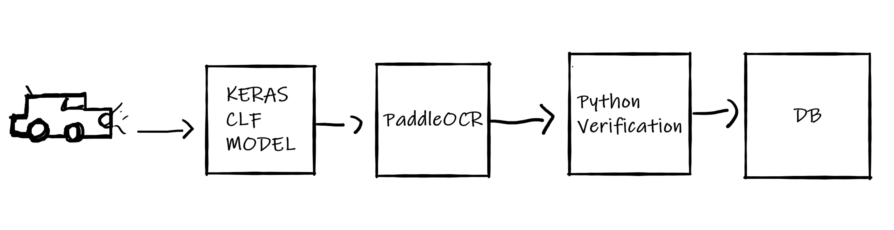
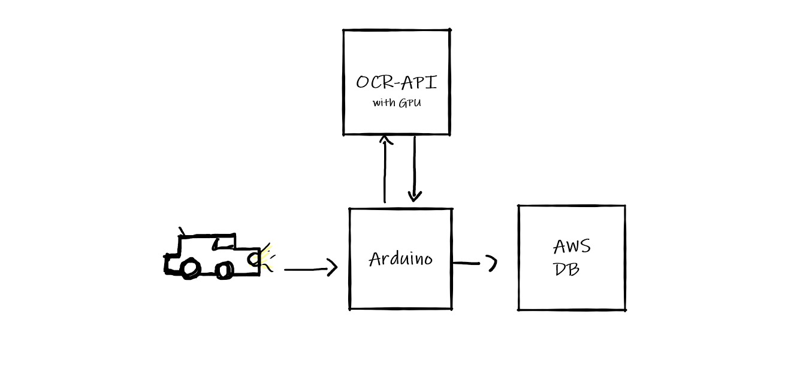

# ANPR - Programming with Python Final Project

Our group was asked to build a parking lot system for the final project. It should handle cars entries, costs, times, etc...
We decided to invest more of our time and build an OCR system to read the licence plates from the car. Of course, in the real world, we would use an Arduino.

## Plan & "pipeline"



When a car arrives at the parking entrance (or exit), our Keras model will predict if there is a car or not and save that frame after it is sent to our OCR system to read the license plate.
When we receive the license number, we must verify if the car is already inside the parking and make the proper requests to our database.
We used easyOCR to read the licence plates for our first prototype, but it was slow a GPU intensive (6GB not enough). 
We found that PaddleOCR was faster and more efficient. Anyways, the Arduino doesn't have too much CPU power to use PaddleOCR. On the other hand, it can be computing demanding. So we decided to divide into two separate services.
For that reason, we built an API to communicate with a serverless computer and read the licenses plates.

Our two services from the project. 
1. Arduino
2. OCR API



### 1. Arduino
In the Arduino, we use OpenCV to read frame by frame from the webcam. Each frame goes to the Keras model to predict if there is a car or not.
Keras model is very lightweight, and we could even use TFLite to have better performance.
When the model is 90% sure of a license plate, it sends this last frame to the OCR API.
<br>
After, our Arduino receives the answer and processes the information with the database.

#### Requirements
* opencv-python
* tensorflow
* sqlalchemy
* requests

#### Run
```
python main.py
```

### 2. OCR-API
We used FastAPI to receive the necessary data from our Arduino. 
Then it processes and returns the license plate.
<br>
A dockerfile is prepared to build a docker container and upload it to a cloud serverless computer.

#### Requirements
* fastapi
* opencv-python
* uvicorn
* python-multipart
* paddleocr
* paddlepaddle-gpu (or paddlepaddle-cpu)

#### Run
```
docker build -t ocr-api -f Dockerfile .
docker-compose -f docker-compose.yaml pull
docker-compose -f docker-compose.yaml up
```

Like this, it is possible to host in any cloud provider. 

## License
This project is licensed under the terms of the MIT license.